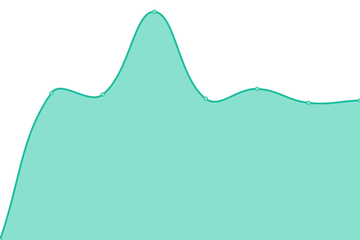

# [📈 Live Status](https://StartUpNationLabs.github.io/KubernetesUpptime): <!--live status--> **🟧 Partial outage**

This repository contains the open-source uptime monitor and status page for [StartUpNationLabs](https://StartUpNationLabs.github.io/KubernetesUpptime), powered by [Upptime](https://github.com/upptime/upptime).

With [Upptime](https://upptime.js.org), you can get your own unlimited and free uptime monitor and status page, powered entirely by a GitHub repository. We use [Issues](https://github.com/StartUpNationLabs/KubernetesUpptime/issues) as incident reports, [Actions](https://github.com/StartUpNationLabs/KubernetesUpptime/actions) as uptime monitors, and [Pages](https://StartUpNationLabs.github.io/KubernetesUpptime) for the status page.

<!--start: status pages-->
<!-- This summary is generated by Upptime (https://github.com/upptime/upptime) -->
<!-- Do not edit this manually, your changes will be overwritten -->
<!-- prettier-ignore -->
| URL | Status | History | Response Time | Uptime |
| --- | ------ | ------- | ------------- | ------ |
|  [Minio API](https://api.minio-main.storage.apoorva64.com/minio/health/live) | 🟩 Up | [minio-api.yml](https://github.com/StartUpNationLabs/KubernetesUpptime/commits/HEAD/history/minio-api.yml) | 

 514ms
     
 | 

<a href="https://StartUpNationLabs.github.io/KubernetesUpptime/history/minio-api">80.85%</a>
    

|  [Grafana](https://grafana.monitoring.apoorva64.com) | 🟩 Up | [grafana.yml](https://github.com/StartUpNationLabs/KubernetesUpptime/commits/HEAD/history/grafana.yml) | 

 1766ms
     
 | 

<a href="https://StartUpNationLabs.github.io/KubernetesUpptime/history/grafana">53.16%</a>
    

|  [Harbor](https://harbor.devops-tools.apoorva64.com) | 🟥 Down | [harbor.yml](https://github.com/StartUpNationLabs/KubernetesUpptime/commits/HEAD/history/harbor.yml) | 

 0ms
     
 | 

<a href="https://StartUpNationLabs.github.io/KubernetesUpptime/history/harbor">0.00%</a>
    

|  [Auth](https://keycloak.auth.apoorva64.com) | 🟩 Up | [auth.yml](https://github.com/StartUpNationLabs/KubernetesUpptime/commits/HEAD/history/auth.yml) | 

 164ms
     
 | 

<a href="https://StartUpNationLabs.github.io/KubernetesUpptime/history/auth">81.85%</a>
    

|  [OpenWebUi](https://open-webui.ai.apoorva64.com) | 🟩 Up | [open-web-ui.yml](https://github.com/StartUpNationLabs/KubernetesUpptime/commits/HEAD/history/open-web-ui.yml) | 

 493ms
     
 | 

<a href="https://StartUpNationLabs.github.io/KubernetesUpptime/history/open-web-ui">81.44%</a>
    

|  [React Flight Tracker](https://react-flight-tracker.apoorva64.com) | 🟩 Up | [react-flight-tracker.yml](https://github.com/StartUpNationLabs/KubernetesUpptime/commits/HEAD/history/react-flight-tracker.yml) | 

 617ms
     
 | 

<a href="https://StartUpNationLabs.github.io/KubernetesUpptime/history/react-flight-tracker">77.68%</a>
    

|  [React Flight Tracker Dev](https://react-flight-tracker.dev.apoorva64.com) | 🟩 Up | [react-flight-tracker-dev.yml](https://github.com/StartUpNationLabs/KubernetesUpptime/commits/HEAD/history/react-flight-tracker-dev.yml) | 

 505ms
     
 | 

<a href="https://StartUpNationLabs.github.io/KubernetesUpptime/history/react-flight-tracker-dev">77.67%</a>
    

|  [Sonarqube](https://sonarqube.devops-tools.apoorva64.com) | 🟩 Up | [sonarqube.yml](https://github.com/StartUpNationLabs/KubernetesUpptime/commits/HEAD/history/sonarqube.yml) | 

 477ms
     
 | 

<a href="https://StartUpNationLabs.github.io/KubernetesUpptime/history/sonarqube">81.50%</a>
    

|  [Weave GitOps](https://weave-gitops.devops-tools.apoorva64.com) | 🟩 Up | [weave-git-ops.yml](https://github.com/StartUpNationLabs/KubernetesUpptime/commits/HEAD/history/weave-git-ops.yml) | 

 462ms
     
 | 

<a href="https://StartUpNationLabs.github.io/KubernetesUpptime/history/weave-git-ops">82.29%</a>
    

|  [RickRoll](https://yes.apoorva64.com) | 🟩 Up | [rick-roll.yml](https://github.com/StartUpNationLabs/KubernetesUpptime/commits/HEAD/history/rick-roll.yml) | 

 444ms
     
 | 

<a href="https://StartUpNationLabs.github.io/KubernetesUpptime/history/rick-roll">82.30%</a>
    

<!--end: status pages-->

[**Visit our status website →**](https://StartUpNationLabs.github.io/KubernetesUpptime)

## 📄 License

- Powered by: [Upptime](https://github.com/upptime/upptime)
- Code: [MIT](./LICENSE) © [Anand Chowdhary](https://anandchowdhary.com), supported by [Pabio](https://pabio.com)
- Data in the `./history` directory: [Open Database License](https://opendatacommons.org/licenses/odbl/1-0/)
